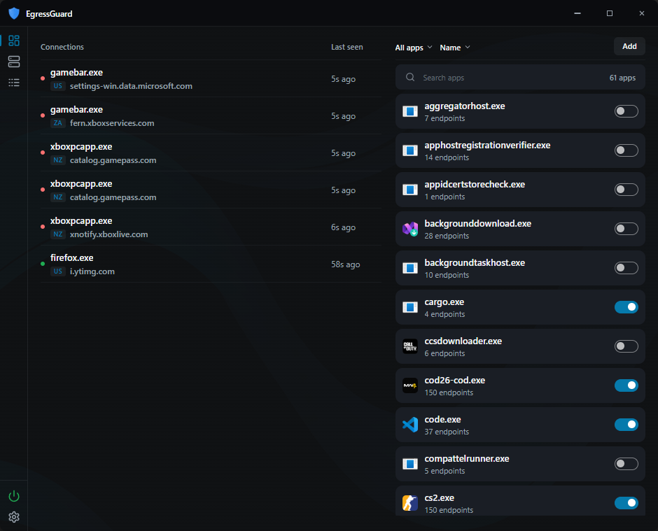

# EgressGuard

EgressGuard is an egress filter for Windows.  
It denies all outbound traffic until you allow a program or a Windows service.  
The product is local. It does not use a custom kernel driver.

To set up, see [docs/setup.md](docs/setup.md).

## Protection

When Protection is on, EgressGuard blocks outbound connections.  
Filters stay active if you close the UI or stop the service.  
Filters clear only when you turn Protection off or uninstall the product.

EgressGuard does not filter inbound traffic or loopback traffic.  
By default, ping, multicast, and a small set of Windows services are allowed.

## How it works

EgressGuard uses the Windows Filtering Platform (WFP) in user mode.  
It applies filters only on outbound connect layers.

A protected default-deny rule blocks everything that no explicit rule permits.  
The service watches connect events and DNS answers so the UI can show process, destination, protocol, and verdict.

More details, see [docs/architecture.md](docs/architecture.md).